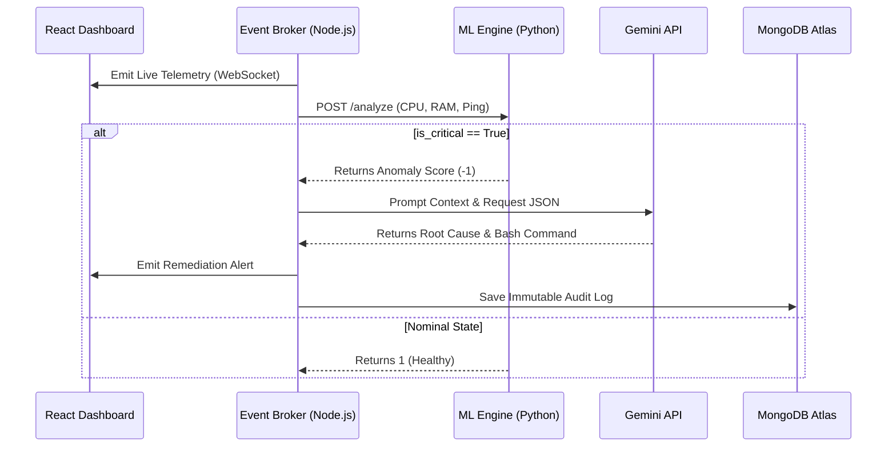

# ⚡ Omni-Node Operations Mesh

**Autonomous Infrastructure Telemetry & Self-Healing SRE Pipeline**

*An event-driven microservice architecture that monitors server cluster telemetry in real-time, detects anomalies using unsupervised machine learning, and deploys Gemini-powered autonomous agents to mitigate infrastructure failures instantly.*

---

## 📖 Table of Contents

* [Overview](https://www.google.com/search?q=%23-overview)
* [Key Features](https://www.google.com/search?q=%23-key-features)
* [System Architecture](https://www.google.com/search?q=%23-system-architecture)
* [Tech Stack](https://www.google.com/search?q=%23-tech-stack)
* [Local Development Setup](https://www.google.com/search?q=%23-local-development-setup)
* [Environment Variables](https://www.google.com/search?q=%23-environment-variables)
* [Deployment Strategy](https://www.google.com/search?q=%23-deployment-strategy)
* [Roadmap](https://www.google.com/search?q=%23-roadmap)

---

## 🔭 Overview

In large-scale enterprise environments, the greatest vulnerability to uptime is human reaction time. When critical infrastructure spikes in CPU or memory, paging a human Site Reliability Engineer (SRE) often results in 15+ minutes of downtime, SLA breaches, and revenue loss.

**Omni-Node** completely removes the human operations bottleneck. By establishing a persistent WebSocket mesh, this system streams cluster telemetry to a Python-based machine learning microservice. When Isolation Forest algorithms detect geometric outliers in the data, the system instantly prompts a Google Gemini LLM. The AI acts as an autonomous engineer, diagnosing the root cause and generating exact bash remediation commands in milliseconds, while persisting a permanent audit trail to MongoDB.

---

## ✨ Key Features

* **High-Frequency Telemetry:** Streams real-time simulated server metrics (CPU, RAM, API Ping) across a bidirectional WebSocket mesh.
* **Unsupervised Anomaly Detection:** Replaces static thresholds with `scikit-learn` Isolation Forests to mathematically flag structural deviations in server behavior.
* **Autonomous Remediation:** Leverages Google Gemini 2.5 Flash SDK to dynamically generate context-aware JSON payloads containing exact Linux mitigation scripts.
* **Immutable Audit Ledger:** Enforces a strict MongoDB schema to permanently log every AI decision, ensuring 100% accountability and trace routing for human review.
* **Distributed Multi-Cloud Architecture:** Decouples the frontend, event broker, and ML engine across highly available, zero-cost edge networks.

---

## 🏗 System Architecture

The pipeline operates on an asynchronous, cyclic control loop distributed across distinct microservices.



---

## 💻 Tech Stack

| Component | Technology | Purpose |
| --- | --- | --- |
| **Control Plane** | `Node.js / Socket.io` | Asynchronous event orchestration and data routing. |
| **Frontend UI** | `React / Tailwind` | Real-time cinematic dark-mode state visualization. |
| **ML Microservice** | `Python / FastAPI` | High-performance inference endpoint for Isolation Forests. |
| **AI Reasoning** | `Google GenAI SDK` | Deterministic structured JSON generation for system repairs. |
| **Persistence** | `MongoDB / Mongoose` | Cloud ledger for AI audit trails and post-mortem analysis. |
| **Hosting** | `Docker / Vercel / HF` | Containerized runtime and global edge delivery. |

---

## 🛠 Local Development Setup

To run the Omni-Node mesh locally, you must spin up all three microservices in separate terminal instances:

**1. Clone the repository**

```bash
git clone https://github.com/yourusername/omni-node-ops.git
cd omni-node-ops

```

**2. Start the Python ML Engine**

```bash
cd anomaly-engine
python -m venv venv
source venv/bin/activate  # Windows: venv\Scripts\activate
pip install -r requirements.txt
uvicorn main:app --host 0.0.0.0 --port 8000 --reload

```

**3. Start the Node.js Event Broker**

```bash
cd ../mesh-broker
npm install
node server.js

```

**4. Start the React Command Center**

```bash
cd ../client-ui
npm install
npm start

```

---

## 🔐 Environment Variables

Create a `.env` file in the `mesh-broker` directory. The system requires the following keys to orchestrate the pipeline:

| Variable | Description | Where to get it |
| --- | --- | --- |
| `GEMINI_API_KEY` | Authenticates reasoning requests to the GenAI engine. | [Google AI Studio](https://aistudio.google.com/) |
| `MONGO_URI` | Connection string for the immutable audit ledger. | [MongoDB Atlas](https://www.google.com/search?q=https://www.mongodb.com/cloud/atlas) |
| `PYTHON_ENGINE_URL` | Route to the ML microservice (e.g., `http://localhost:8000/api/v1/analyze`). | Local or Hosted URL |
| `PORT` | Defines the listening port for the Node.js Express server. | Standard: `8080` or `7860` |

> **Warning:** Never commit your `.env` file to version control. Ensure it is included in your `.gitignore` prior to deployment.

---

## 🚀 Deployment Strategy

Omni-Node is architected for a multi-cloud, containerized edge deployment, strictly utilizing $0 infrastructure tiers.

**Dockerfile Implementation:**
The Node.js and Python engines are fully dockerized, explicitly exposing port `7860` to comply with Hugging Face Space requirements.

To deploy:

1. **Python Engine:** Deploy `anomaly-engine` as a Blank Docker Space on **Hugging Face**.
2. **Node.js Broker:** Deploy `mesh-broker` as a second Blank Docker Space on **Hugging Face**, updating the `.env` secrets via the Space settings.
3. **React UI:** Deploy `client-ui` to **Vercel**, updating the WebSocket URL target to the live Hugging Face Broker endpoint.

---

## 🛣 Roadmap

* [x] Distributed telemetry routing via WebSockets.
* [x] Unsupervised machine learning anomaly integration.
* [x] Gemini 2.5 AI agent remediation logging.
* [x] Multi-cloud Docker containerization.
* [ ] Integrate live production Datadog/Prometheus API ingestion.
* [ ] Implement secure SSH handshakes for physical script execution on target nodes.
* [ ] Add Twilio webhook for "Human-in-the-loop" destructive command authorization.